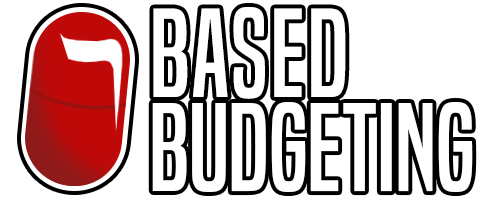

<h1 align="center">
   
  
   
</h1>

<h3><b><u>BASED BUDGETING </u> 
💰📈 GENERAL HANDBOOK 📊💵 </b></h3>
  <h3>
    <a href="https://www.youtube.com/matthiasbenaets/...">
      Tutorial
    </a>
     · 
    <a href="https://github.com/MatthiasBenaets/BasedBudgeting/blob/master/LICENSE">
      License
    </a>
     · 
    <a href="https://github.com/matthiasbenaets/basedbudgeting/releases/">
      Download
    </a>
     · 
    <a href="https://github.com/matthiasbenaets/basedbudgeting/issues">
      Issues
    </a>
     · 
    <a href="https://matthiasbenaets.github.io/">
      Contact
    </a>
  </h3>
  <h1></h1>

Based Budgeting is a budgeting application written in Visual Basic .NET for Windows.

The applications aims to make you get a hold of your personal finances and set limits on expenses, all while growing your net worth and purchase power.

Either take the blue pill and live in ignorance and debt, or take the red pill and discover potential financial growth and become debt free.

##  📋Table of Contents
- [🏷️Features](#%EF%B8%8Ffeatures)
- [🕹️Usage](#%EF%B8%8Fusage)
- [🧩Components](#components)
- [⌛Download](#download)
- [🙋FAQ](#faq)
- [👋Contact](#contact)
  
##  🏷️Features
- **Give Your Money A Job**: With Multi-Category Budgeting, split transaction in multiple (sub-)categories
- **Visualise balance**: Visual representation of transactions and net worth
- **Transaction Tracker**: Log all inflow and outflow of your accounts
- **Keeping track of the past**: All monthly budgets and bank balances will be stored for reference in the future
- **User Friendly**: Aimed to make the process as much of as possible automated
- **Stocks Logger**: Coming soon™
  
##  🕹️Usage
Coming soon™

</img>
</img>
</img>
</img>
  
##  🧩Components
- **Accounts:**
    - Add multiple bank accounts to the budget
    - Keep track of bank accounts, cash or even your investment portfolio balance at one place
    - Balance will stay updated and calculated automatically after initial setup
- **Budget:**
    - Keep a budget for the current month and review budget from previous months
    - List different categories and subcategories
        - Budget available money from your budget
        - Review monthly activity of the different categories.
        - Follow up on the available balance of your budgeted categories
    - Always be on top of how much you budgeted, your inflow & outflow and overall availablity of the current month
- **Reports:**
    - Net worth chart: Visualise money diversification
    - Current month doughnut spending chart: link to your subcategories
    - 1 Year stacked column spending chart: link to your subcategories
- **All Accounts:**
    - Add transactions linked to your given accounts and subcategories
    - Transactions will automatically update your account balance and budget activity
- **To Be Budgeted:**
    - The "To Be Budgeted" feature on the budget menu is used to give your money a job.
    - It will prompt you to allocate your money to different categories, but don't allocate to much, or you might go in the red.
  
##  ⌛Download
### **[Releases](https://github.com/MatthiasBenaets/BasedBudgeting/releases)**
### **[Latest Version](https://github.com/MatthiasBenaets/BasedBudgeting/releases/tag/v1.1.2)**
  
##  🙋FAQ
Nothing to tell at the moment.

Ask a question [HERE](https://github.com/MatthiasBenaets/BasedBudgeting/discussions)
  
##  👋Contact
- [Issues or Feature Request](https://github.com/MatthiasBenaets/BasedBudgeting/issues)
- [Resume](https://matthiasbenaets.github.io/)
- [Donate](https://www.paypal.com/donate?hosted_button_id=VXJ2AVMJRQUBY)

## Disclaimer
Based Budgeting is heavily inspired by YNAB.

You Need a Budget (YNAB) is a trademark of You Need A Budget LLC, which is not affiliated with the maker of this project and does not endorse this project.

All assets and names are trademarks of their respective holders. Use of them does not imply any affiliation with or endorsement by them.

